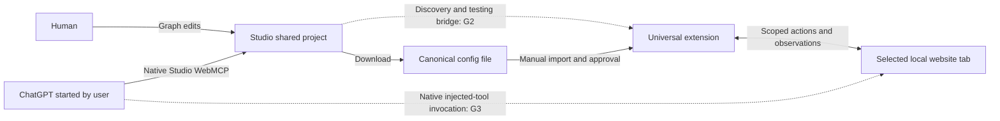

# WebMCP Studio

## Hackathon development brief

**Completed:** August 28, 2026 · **Planning timezone:** Singapore (SGT, UTC+8)

**Document status:** Consolidated development brief, preserving the recorded product decisions.

**Evidence status:** The repository contains an extension prototype. This brief does not certify completion of the MVP or any native ChatGPT/browser compatibility gate.

This is the repository planning reference for the agreed hackathon MVP. Supporting technical evidence is retained in the [Printing Press and discovery research](research/printing-press-discovery.md). The personal conversation transcript and device-handoff files are not part of the repository.

**Relationship to the prototype:** The existing [extension design](superpowers/specs/2026-08-28-webmcp-polyfill-design.md) describes a narrower DOM-inference runtime and inspector. It is an implementation starting point, not the full Studio product. Map its Capability Graph, adapter hooks, and browser API handling to the canonical config, declarative node palette, and G1–G3 below. Mocked WebMCP tests or inspector invocation alone do not establish native ChatGPT compatibility. No code changes or runtime tests were performed as part of importing this brief.

**The first technical gate is the complete ChatGPT/browser connection:** native Studio WebMCP calls, a supported connection to our extension and the exact user-selected local tab, and native ChatGPT invocation of extension-injected target-site tools. Documentation supports parts of this path; the complete path remains untested. ChatGPT and local-tab discovery are settled choices. A failed experiment requires an explicit design or scope decision, not an unannounced replacement agent, hosted inference service, or relay.

### How to read this brief

- **Approved scope** records user decisions. Transcript message numbers identify their provenance.
- **Recommended implementation** gives the builders a coherent starting design. Exact field names, libraries, limits, and UI details are not presented as previously approved commitments.
- **Verification gates** name evidence still required. A proposed design, valid config, or successful source lookup does not close a runtime gate.

## 1. Product and audience

**WebMCP Studio lets a human and ChatGPT turn observed website capabilities into reusable tools, edit those tools together, and run them in the user's live website tab.**

The user enters a domain in Studio. ChatGPT, started by the user, discovers useful capabilities through Studio's WebMCP interface and the extension's access to a selected local tab. Discovery produces a canonical config containing reusable actions and suggested tool flows. The human and agent refine that same config through a visual editor and WebMCP authoring tools. The user exports it and imports it into one universal extension for approved execution on matching pages.

The problem hypothesis is that useful website capabilities take repeated investigation and custom integration work to make available to agents. Studio makes that work inspectable, editable, and portable while retaining the page state the human sees. This is a product hypothesis, not validated market demand or a guarantee of arbitrary-site compatibility.

Developers and technical power users are the initial audience; everyday users are also intended beneficiaries. Creating and using tools are activities, not exclusive roles. Technical users can inspect requests, selectors, and bindings. Everyday users should receive understandable guidance, results, and permission explanations through the same product.

**Approved:** Studio exposes its usage guide through WebMCP, including the current project's suggested next step and blockers. **Recommended, not an approved release requirement:** demonstrate one creation journey requiring no manual node or JSON editing. The transcript did not explicitly approve that additional acceptance check. Guided assistance must use the same config and canvas; it does not introduce a separate agent service or product.

### Why WebMCP matters

Studio itself is a shared application for the human and agent: the human adds a step, ChatGPT inspects and connects it through an actual WebMCP call, and both can inspect the result. The extension then exposes the authored capability on the target page. Both uses of WebMCP are central to the demonstration.

The researched Printing Press workflow already produces CLI and MCP outputs. Its browser capture process targets integrations that subsequently run without retaining a browser. Studio's intended distinction is execution in the live page plus shared visual authoring. That distinction is a design thesis to demonstrate, not an already measured advantage. See the [pinned Printing Press findings](research/printing-press-discovery.md), based on revision `56e2e46b8decb11fcca246b7c6f45ec04250fe08`.

## 2. Approved MVP scope

These are the agreed product decisions consolidated on August 28. They define target scope, not the current prototype's implementation coverage.

| Area               | Settled decision                                                                                                                                                                                                                                        |
| ------------------ | ------------------------------------------------------------------------------------------------------------------------------------------------------------------------------------------------------------------------------------------------------- |
| Entry              | Studio offers domain entry to create tools for a website. Domain entry prepares discovery; it does not launch an arbitrary agent session.                                                                                                               |
| Agent              | The user starts **ChatGPT**, the external demo agent. Studio hosts no inference, agent loop, model-provider selector, or model API credential collection.                                                                                               |
| Browser            | **Use my browser** is the sole MVP discovery path, through our extension and an explicitly selected local tab. The user and agent work with that tab's current state.                                                                                   |
| Authentication     | Public discovery is the default. Optional authenticated discovery and human login/resume are included. Reuse a valid login in the connected tab within approved scope.                                                                                  |
| Canonical artifact | Discovery generates the config, Studio renders and edits it, and the extension imports and executes it. Reopening it does not require another AI conversion.                                                                                            |
| Editor model       | One site project contains a tool list. Selecting a tool opens its own n8n-like flow editor. Multiple action nodes can compose one tool.                                                                                                                 |
| Node ownership     | Each executable node instance belongs to at most one tool flow. Reusing an action creates an independent instance.                                                                                                                                      |
| Discovery output   | Automatically suggest useful draft tools with composed flows where observations support them. Retain reusable discovered actions. Partial discovery may return actions and blockers without inventing complete flows. Suggestions never activate tools. |
| Studio WebMCP      | Expose shared project inspection, authoring, discovery, and testing capabilities. Human and agent operate on the same project state.                                                                                                                    |
| Guide              | Expose Studio's usage guide through WebMCP, with the current project's next step and blockers.                                                                                                                                                          |
| Agent authority    | Permit direct, visible, undoable draft edits. Activation, publishing, and consequential website actions require human approval.                                                                                                                         |
| Node palette       | HTTP requests, DOM actions, waiting, extraction, simple transforms, conditions, and return. No custom JavaScript nodes initially.                                                                                                                       |
| Execution          | Sequential steps with explicit if/else branches. Loops, parallel execution, and nested/reusable subflows are deferred.                                                                                                                                  |
| Distribution       | Download the config from Studio and import it into the extension; the same file can be reopened in Studio. Automatic synchronization and a public registry are deferred.                                                                                |
| Audience           | Start with developers and technical power users while making the product useful to everyday users.                                                                                                                                                      |
| Team               | Two builders using AI assistance. The team determines its own work allocation. The user's cutoff is approximately Saturday, August 29 afternoon SGT, with vacation on Sunday.                                                                           |

Reddit is the user's preferred first demo candidate, conditional on permitted access and runtime suitability. It is not an established integration. A controlled site is a recommended test fixture and possible fallback, not a restriction on domain input or proof of Reddit compatibility.

## 3. End-to-end user journey

1. **Create or reopen a project.** Enter a domain, optionally narrow the desired outcome, or import an existing config. Studio can edit configs without the extension; browser discovery cannot proceed without it.
2. **Connect the exact target tab.** The human selects the tab through an explicit extension action, reviews the site and exploration scope, and chooses public or authenticated exploration. A valid authorized session skips login. If login is necessary, the human completes it directly and explicitly resumes.
3. **Start ChatGPT.** Studio explains the verified client/browser setup and prepared request. A copyable prompt is a suggested convenience. Discovery activity is shown only after actual tool calls begin; a domain submission or connection indicator is not evidence that an agent is working.
4. **Discover within scope.** ChatGPT reads Studio's guide, observes the connected page, investigates useful interactions and permitted requests, and submits discoveries in the canonical format. Studio shows findings, inferred behavior, untested steps, and blockers separately.
5. **Refine a tool together.** Select a suggested tool or create one from discovered actions. The human adds or changes a node; ChatGPT reads the same draft and edits the intended tool. Changes are visible and undoable. Unused actions remain in the palette.
6. **Test the current revision.** Run the selected tool against the authorized tab with explicit inputs. Show the trace, returned data, and expected page effects. Consequential actions require approval even during a test. An edit makes earlier test evidence historical.
7. **Transfer the config.** Download the file and manually import it into the extension. Present this as a guided download/upload; users do not need to open the JSON. This transfer does not establish ongoing synchronization.
8. **Review and activate.** Validate the file without executing website actions. Show requested site scope, tools, and capabilities. The human approves a specific snapshot and the applicable permissions; importing alone grants neither.
9. **Invoke and revisit.** ChatGPT discovers and invokes the eligible injected tool on the target page through the verified native WebMCP path. The extension checks the current session and returns observable results. The same file remains editable in Studio.

**Core demonstration outcome:** a useful tool derived from actual discovery is edited by both human and agent, tested, transferred, approved, and invoked. One working flow is the first integration milestone; it does not reduce the agreed palette, authentication behavior, or other MVP capabilities.

## 4. Architecture and component boundaries

The diagram shows intended responsibilities. Dashed connections are unresolved compatibility gates, not implemented transports.

### Recommended implementation

| Component                     | Owns                                                                                                                                                    | Boundary                                                                                                |
| ----------------------------- | ------------------------------------------------------------------------------------------------------------------------------------------------------- | ------------------------------------------------------------------------------------------------------- |
| External ChatGPT client       | Inference, conversation, account, agent loop, and decisions about which authorized tool to call.                                                        | Studio cannot launch arbitrary existing sessions or stop the client's inference by disconnecting a tab. |
| Studio                        | Tool list, flow canvas, action palette, inspector, guide, activity, test traces, import/export, and authoritative draft state.                          | No embedded assistant service. The conversation stays in ChatGPT.                                       |
| Shared command layer          | Human and agent edits, validation, revision checks, and draft undo.                                                                                     | Neither interface gets an alternative config model or privileged mutation path.                         |
| Shared config/runtime library | Format versions, validators, bindings, and sequential/conditional execution semantics.                                                                  | This is the project's format, not an official WebMCP workflow standard.                                 |
| Extension                     | Approved tab connection, bounded observations/actions, local session handling, imported snapshots, activation, and runtime tool registration/execution. | Discovery access and installed config execution are separate modes to verify.                           |
| Target page                   | Live DOM, route, application state, and website session.                                                                                                | The website remains authoritative for account access; a config never transfers authentication.          |

Keep the extension's privileged control logic separate from the smallest packaged page-side registration/execution adapter. Chrome's `MAIN` execution world is a candidate to test; imported JSON supplies configuration, not downloaded JavaScript. Chrome's scripting, debugger, and messaging APIs are candidate building blocks, not proof of the complete connection. `externally_connectable` assumes Studio can actually reach the extension in that browser environment. An unrestricted JavaScript or CDP endpoint is not an acceptable bridge. [Chrome scripting API](https://developer.chrome.com/docs/extensions/reference/api/scripting), [debugger API](https://developer.chrome.com/docs/extensions/reference/api/debugger), [extension messaging](https://developer.chrome.com/docs/extensions/develop/concepts/messaging).

The browser/profile boundary must be resolved in G2 before this transport is treated as viable. An additional relay or companion would need an explicit design, permission model, and approval; none is silently included here. Framework, graph library, persistence mechanism, and hosting provider remain implementation choices for the builders.

## 5. Canonical config and lifecycle

### Concepts

| Concept           | Meaning                                                                                                                                                                    |
| ----------------- | -------------------------------------------------------------------------------------------------------------------------------------------------------------------------- |
| Discovered action | A reusable template inferred from an observed request or interaction, with safe settings, prerequisites, and evidence references. It is not automatically a callable tool. |
| Node instance     | A configured step owned by one tool. Copying a template creates a new ID and independent settings.                                                                         |
| Workflow          | The tool's steps, control edges, and value bindings. It may contain one or many steps.                                                                                     |
| Tool definition   | A named interface with inputs, a result contract, and its owned workflow. An incomplete definition may remain a draft.                                                     |
| Site project      | The canonical document containing all tool definitions, reusable discoveries, site scope, and editor metadata.                                                             |

### Recommended schema outline

Use a versioned declarative JSON format and one shared validator. The following names are a design proposal, not a finalized JSON Schema or an implemented file format.

| Section             | Proposed contents                                                                                                                   |
| ------------------- | ----------------------------------------------------------------------------------------------------------------------------------- |
| `schemaVersion`     | Format version understood by Studio and the extension.                                                                              |
| `project`           | Stable project ID, display name, and revision.                                                                                      |
| `site`              | Page matching rules, requested execution/request origins, and supported session checks. Requested scope does not grant permission.  |
| `discoveredActions` | Reusable templates, inferred input/result shapes, access prerequisites, and references to separately retained evidence.             |
| `tools`             | Stable IDs, names, descriptions, input/result contracts, access requirements, and an owned `workflow` with entry, nodes, and edges. |
| `editor`            | Tool-list order, selected tool, node positions, and viewport state. This has no execution authority.                                |

Store all public and protected definitions in one config. Resolve their availability from the current target-site session; login/logout does not require regenerating the file. A field such as `availability.userSession` is project metadata, not a native WebMCP field. Keep approvals, connection secrets, raw captures, and live session state outside the distributable config.

### Recommended invariants

- Config import → edit → export → re-import preserves executable meaning, IDs, and layout. Rendering the graph is deterministic.
- Edges and step references resolve inside the owning workflow. No cross-tool edges, calls, or shared mutable nodes. Template changes do not rewrite existing instances automatically.
- Bind values using explicit references to tool inputs, prior outputs available on the current path, and supported local runtime values. Do not evaluate arbitrary JavaScript expressions or downloaded code.
- Drafts may contain unfinished or disconnected work. A runnable tool needs complete supported steps, resolvable bindings, explicit branch destinations, and a defined result on each permitted completion path.
- Distinguish observed facts, inferred definitions, and tested behavior. Schema validity cannot establish website compatibility or permission.
- Reject unsupported versions and executable features with actionable errors. Never silently drop behavior during a round trip.

### Keep lifecycle checks separate

| Check                | What it establishes                                                  | What it does not establish                                                    |
| -------------------- | -------------------------------------------------------------------- | ----------------------------------------------------------------------------- |
| Valid draft          | The project can be represented and edited.                           | A complete or working tool.                                                   |
| Runnable definition  | The selected workflow passes execution-readiness validation.         | Permission to act or successful website behavior.                             |
| Test evidence        | A specific revision, inputs, and session produced a recorded result. | Success for later edits, other accounts, or arbitrary sites.                  |
| Approved activation  | The human approved an imported snapshot and its scope.               | Blanket authorization for consequential actions.                              |
| Current availability | The page and session presently satisfy a tool's prerequisites.       | Authorization for the proposed invocation or continuation after session loss. |

Recommend binding approval to an identifiable snapshot and showing changed scope on re-import. Draft edits do not change the activated version. A revised file must not silently inherit permission for expanded capabilities. Publication approval remains a policy requirement; it does not add a registry or publishing service to the MVP.

## 6. Execution semantics

**Approved:** the fixed palette below, sequential execution, and explicit if/else. **Recommended:** the detailed contracts and failure behavior in this section.

| Step type        | Intended behavior                                                                     | Contract to specify and test                                                                                                                        |
| ---------------- | ------------------------------------------------------------------------------------- | --------------------------------------------------------------------------------------------------------------------------------------------------- |
| HTTP request     | Issue an approved request using declared inputs and supported local session bindings. | Allowed destinations, methods, headers, body mappings, result parsing, and request/session failure. Capturing a request does not prove safe replay. |
| DOM action       | Perform a supported interaction such as fill, select, or click in the selected page.  | Target resolution, expected page state, scope, and required human approval.                                                                         |
| Wait             | Wait for a declared element, state, or completion condition.                          | Finite deadline, cancellation, and an explicit timeout.                                                                                             |
| Extract          | Read declared fields from an observed page or response.                               | Result shape, absent-field behavior, and data minimization.                                                                                         |
| Simple transform | Apply supported deterministic operations such as projection or a bounded filter.      | Typed operators and missing-value behavior; no arbitrary code. Internal collection operations do not introduce workflow loops.                      |
| Condition        | Evaluate a supported predicate and take one explicit true/false edge.                 | Exactly one chosen branch per run; exercise both branches in tests.                                                                                 |
| Return           | Complete the flow with its declared result.                                           | Result validation and serialization through the tested WebMCP API adapter.                                                                          |

Each invocation gets its own values and a fixed config revision. Normal steps have one next step; conditions choose one branch; return terminates. Reject cycles and unsupported parallel/nested execution before a tool can run. A binding may not assume an output from a branch that did not execute.

Use the same interpreter semantics for Studio tests and installed execution. Recommend serializing commands against a connected tab so two runs, or a run and human takeover, cannot interleave unnoticed. Record the run ID, tool/config revision, current step, sanitized inputs/outputs, result, and failure reason.

On timeout, missing elements, invalid bindings, cancellation, denied permission, session loss, or document replacement that the runtime cannot safely continue across, stop visibly. Do not automatically replay an action whose effects are uncertain. Cancelling further steps or undoing the draft cannot reverse a request already sent to a website.

Test full-page navigation, SPA route changes, registration cleanup, and tool-name collisions explicitly. Do not silently replace native or unrelated tools. A click succeeding does not prove that a multi-step flow can continue after navigation, and an HTTP success does not prove that the visible UI reflects the intended result.

## 7. Studio WebMCP and shared authoring

**Approved behavior:** humans and ChatGPT inspect and modify the same project, with direct visible draft edits, undo, and an agent-readable guide. Studio also supplies the scoped discovery operations that the external agent needs.

### Recommended command design

Route UI gestures and WebMCP calls through the same command layer. Give each project, tool, and node a stable ID. Require the current revision on mutations and apply related changes atomically. Reject stale edits with a conflict and a fresh-read instruction; do not overwrite intervening human work.

Agent commands identify a tool explicitly. The human's current tool selection is presentation state, so switching the canvas cannot redirect an in-flight agent edit. Show who changed the draft, what changed, and the resulting revision. Undo applies to draft changes, not website effects. Test evidence stays attached to the revision that actually ran.

The following interfaces are illustrative capability boundaries, not fixed names or finalized schemas:

| Capability           | Example interface                                                | Required boundary                                                                                                  |
| -------------------- | ---------------------------------------------------------------- | ------------------------------------------------------------------------------------------------------------------ |
| Read guidance        | `get_studio_guide(topic?)`                                       | Read-only application guidance and current next step/blockers, including before a project exists.                  |
| Inspect shared state | `read_project()`, `read_tool(toolId)`                            | Return the authoritative draft, revision, findings, and validation/test state.                                     |
| Define a tool        | `define_tool(definition, expectedRevision)`                      | Create or update a draft interface and owned flow; never activate it.                                              |
| Edit a flow          | `edit_workflow(toolId, changes, expectedRevision)`               | Apply supported node, connection, and binding changes atomically to the named tool.                                |
| Inspect discovery    | `read_discovery_session()`                                       | Return the prepared domain, approved tab/scope, connection state, findings, and blockers; grant no permissions.    |
| Observe the page     | `observe_page(sessionId)`                                        | Return a sanitized observation and freshness identifier from the connected tab only.                               |
| Act during discovery | `perform_browser_action(sessionId, action, expectedObservation)` | Enforce supported operations, current page/session, scope, and required human approval.                            |
| Inspect requests     | `read_observed_requests(sessionId, cursor)`                      | Return bounded, sanitized evidence captured after attachment.                                                      |
| Apply discoveries    | `apply_discovery_result(sessionId, config, expectedRevision)`    | Validate canonical output and update draft discoveries/tools without losing unrelated work or activating anything. |
| Test a tool          | `test_tool(toolId, inputs, revision)`                            | Start an authorized run on the connected tab and return its run reference.                                         |
| Inspect a run        | `read_test_run(runId)`                                           | Return the same progress, results, and failures the human sees.                                                    |

Connecting a tab, granting permissions, login/resume, takeover, and activation remain under human control. A guide or `start_discovery`-style command cannot supply an agent loop. Revoked sessions must reject further commands even if ChatGPT continues calling tools.

### Guide content

Implement the guide as a normal read-only WebMCP tool. Its description should make it discoverable; no special WebMCP resource, prompt, or skill API is assumed. A `readOnlyHint` describes intent but does not enforce safety. [WebMCP specification](https://webmachinelearning.github.io/webmcp/).

Return a concise overview and detailed topics on request: how to begin with a domain, connection prerequisites, discovery, the tool list and canvas, supported steps, validation, testing, export/import, and approval rules. Derive the current project stage, suggested next step, and blockers from the authoritative project and connection state. After a disconnect, report the loss of live visibility rather than implying that Studio still sees the website.

The same application-authored guidance can power human Help. Keep it versioned with the contracts, distinguish it from untrusted website content, and make reading it free of project mutation, discovery execution, or approval. Do not assume every agent will call it automatically.

## 8. Local browser control, authentication, and safety

The following implementation recommendations enforce the agreed local-tab, login, and approval boundaries.

### Connection and shared control

Bind each connection to an approved Studio origin, project/session, exact tab, and permitted target scope. Validate sender identity and the allowed command set in the extension. Browser installation permissions, including debugger access, do not authorize every task or tab.

Provide pause, human takeover, explicit resume, and disconnect controls. Stop agent actions during takeover and refresh observations before resuming. Stop on tab closure, connection loss, debugger detachment, or navigation outside scope; never switch silently to another matching tab. Do not reload a page with unsaved state to collect missing traffic without approval. Capture starts after attachment; earlier requests are not assumed recoverable.

Use enforceable limits on pages, interactions, request/capture size, waits, and elapsed time. Choose numeric defaults after the controlled experiment and record them in the runtime contract. Validate destinations, redirects, and additional request origins against an explicit public-web policy; block private/local network targets in production discovery. Limits belong in runtime code, not just agent instructions.

### Session-aware discovery and availability

Reuse a valid session in the selected tab after approval for that exploration scope. A login in another browser, profile, or Studio itself is not proof of a target-site session. If login is needed, preserve discoveries, pause agent access, let the human sign in directly, and verify the session after explicit resume.

Public-only exploration must not expand silently into account data because a tab happens to be logged in. Verify guest behavior in a separately authorized unauthenticated context when needed; do not log the user out, clear cookies, or assume a second ordinary tab is unauthenticated. If no guest context is available, label guest behavior unverified. A public discovery pass need not precede every authenticated one.

| Target-site state                     | Recommended registered set                                                  |
| ------------------------------------- | --------------------------------------------------------------------------- |
| Logged out                            | Eligible public tools; protected definitions remain in the config.          |
| Valid authorized session              | Eligible public tools plus protected tools allowed for that account.        |
| Unknown, expired, or changing account | Withhold protected tools until the current account and access are verified. |

Check session/account access again at invocation and before protected side effects. Stop further protected steps after access loss. A tool's declared prerequisites must not be weaker than those of its reachable steps. Public data can still require API authorization; hiding/showing a tool is not the implementation of website permission.

Chrome documents registration removal via a registration `AbortSignal`, separate execution cancellation, and `toolchange`. Consumer refresh, in-flight behavior, and our account transitions require runtime tests; registration removal must not be assumed to cancel an existing run. [Chrome imperative API](https://developer.chrome.com/docs/ai/webmcp/imperative-api).

### Data and approval rules

Keep passwords, cookies, tokens, CSRF values, and connection secrets in the authorized local runtime. Configs contain supported references, not captured secret values. Account-specific bindings resolve against the current invocation's session. Capturing a successful authenticated request does not prove it can be reused safely on another account or after import.

Sanitize headers, form values, URLs, and samples before observations leave the extension. Minimize private content and disclose what the external agent will process. Local browser execution does not mean wholly local data processing. During human login, stop supplying agent observations and apply verified capture/redaction controls; merely hiding a login form in Studio is insufficient. Keep raw evidence and private samples out of distributable configs, public repositories, demo recordings, and shared traces.

| Action                             | Authority boundary                                                                            |
| ---------------------------------- | --------------------------------------------------------------------------------------------- |
| Read a guide or draft              | Does not grant browser access or mutate the project.                                          |
| Edit the shared draft              | The agent may edit directly, with visible changes and undo.                                   |
| Observe or interact with a website | Requires the connected, approved scope; consequential effects need additional human approval. |
| Test a tool                        | Uses the same website-action rules as installed execution.                                    |
| Activate a snapshot                | Requires explicit human approval and applicable browser permissions.                          |
| Publish or share publicly          | Requires human approval; no registry implementation is implied.                               |

Recommend binding consequential approvals to the intended action, meaningful inputs, current account/target, and config revision. Material changes invalidate that approval. Treat imported configs, page content, request data, and model-generated risk labels as untrusted. Do not let an annotation, HTTP method, public page, or text in a config approve its own execution.

## 9. Browser compatibility and verification gates

### Documented starting point, checked August 28

OpenAI documents native Site tools in the ChatGPT desktop app's built-in browser. Its supported setup names GPT-5.6 Sol/Terra, excludes Luna and Enterprise/Edu workspaces, and depends on app version, rollout, and settings. Use top-level imperative registration through `document.modelContext`; ChatGPT's documented subset does not discover declarative form tools or tools inside iframes. These are client prerequisites, not a Studio model integration. [OpenAI Site tools](https://learn.chatgpt.com/docs/webmcp).

That browser uses a separate profile from regular Chrome. OpenAI's separate browser extension supports control of existing browser tabs, but the inspected documentation does not establish native WebMCP consumption through that route or installation of our extension in the built-in browser. This is an evidence gap, not proof of impossibility. [OpenAI browser guide](https://learn.chatgpt.com/docs/browser), [browser-extension guide](https://learn.chatgpt.com/docs/chrome-extension).

Chrome offers a local testing flag and an origin trial beginning with Chrome 149. API availability also depends on origin isolation and the `tools` Permissions Policy. Script injection permission alone does not establish that a target permits tool registration. [Chrome WebMCP](https://developer.chrome.com/docs/ai/webmcp).

Pin the actual API behavior behind a small compatibility adapter. Chrome's guide illustrates `executeTool` with a JSON string while the current draft IDL takes an object; the guide also describes registration lifecycle behavior specific to Chrome 153. Do not assume all documented features exist in every judging browser. [Chrome imperative API](https://developer.chrome.com/docs/ai/webmcp/imperative-api), [WebMCP interface](https://webmachinelearning.github.io/webmcp/#modelcontext-interface).

### Required proof

**All gates below are pending in the supplied record. None was executed during document consolidation.**

| Gate                                | Evidence needed to close it                                                                                                                                                                                            | If evidence is missing or the test fails                                                                                                                                 |
| ----------------------------------- | ---------------------------------------------------------------------------------------------------------------------------------------------------------------------------------------------------------------------- | ------------------------------------------------------------------------------------------------------------------------------------------------------------------------ |
| **G1 — Native Studio authoring**    | In the chosen ChatGPT account/app/browser, discover and call the guide and an authoring tool. Show a visible draft change and a subsequent read of a human edit.                                                       | Record the unsupported API, account setting, or observed failure. Ordinary clicks or direct application-function calls are insufficient.                                 |
| **G2 — Exact local-tab connection** | Demonstrate a supported, authorized path from that Studio session to our extension and the selected local tab. Observe the same page/login state, reflect a human change, and reject revoked or out-of-scope commands. | Record the failing browser/profile/transport boundary. Any additional bridge design needs explicit review; do not copy cookies or assume direct cross-browser messaging. |
| **G3 — Injected tool consumption**  | On a controlled page with no native WebMCP, inject a tool and have **ChatGPT** discover and invoke it through native WebMCP. Check the result and intended visible effect.                                             | Inspector success is diagnostic only. Keep the chosen agent and record the failure before expanding implementation.                                                      |
| **G4 — Complete product journey**   | Actual discovery produces a canonical flow, both interfaces edit it, a current-revision test runs, and export/import/approval leads to successful target invocation. A second setup reproduces it.                     | Identify the incomplete stage; hand-authored fixtures do not count as discovery output.                                                                                  |
| **G5 — Judge access**               | Establish the extension installation/testing expectations and reproduce the advertised setup from the hosted URL and published instructions.                                                                           | Seek organizer clarification or an explicitly approved delivery decision. Do not presume extension installation or extra credentials.                                    |
| **G6 — Reddit candidate**           | Establish an allowed access method covering this project, then verify the actual local discovery and imported execution flow.                                                                                          | Keep Reddit conditional. A controlled fixture can prove mechanics but cannot establish Reddit compatibility.                                                             |

Close G1–G3 in one coherent supported setup before treating the core architecture as validated; independent successes in incompatible browser contexts do not establish the complete path. Record exact app/browser/extension versions, feature settings, execution world, origins and page policies, permissions, config revision, native tool-call evidence, outputs, visible effects, and relevant negative cases. Generic MCP support, ordinary browser automation, code generation, and schema tests are not substitutes for native WebMCP proof.

## 10. Build plan and team handover

Two builders will use AI assistance and allocate work internally. The user's available build window ends around **Saturday, August 29 afternoon SGT**, with vacation on **Sunday, August 30**. The teammate has further availability, but exact hours are unspecified. Do not plan on two full-time builders through submission or depend on the user returning for last-minute work.

### Recommended work packages

| Package                             | Deliverable                                                                                                                    | Dependencies and completion evidence                                                                                 |
| ----------------------------------- | ------------------------------------------------------------------------------------------------------------------------------ | -------------------------------------------------------------------------------------------------------------------- |
| Browser proof and delivery setup    | G1–G3 experiments and a concrete judge-access question/setup.                                                                  | First priority. Preserve exact observations and supported boundaries, including failures.                            |
| Shared contract and interpreter     | Versioned schema, structural/readiness validators, bindings, node contracts, and valid/invalid fixtures.                       | Align with browser proof. Round-trip and execution checks preserve ownership, branches, values, and editor metadata. |
| Studio editor and WebMCP            | Tool list, owned canvases, action palette, inspector, shared commands, guide, revision conflicts, undo, and traces.            | Shared contract and G1. Real human/agent edits affect the same revisioned state.                                     |
| Discovery connection and generation | Approved tab pairing, bounded observations/actions, capture sanitization, login/resume, and canonical discoveries/draft flows. | G2 and shared contracts. Actual external-agent calls produce findings; partial runs preserve blockers.               |
| Extension delivery and execution    | Import/review, snapshot approval, page matching, registration, session eligibility, and traceable interpreter execution.       | G3 and shared runtime. Imported tools run correctly without config credentials or silent scope expansion.            |
| Integration and submission          | G4, acceptance evidence, hosted build, public licensed source/setup, and demonstration.                                        | All preceding packages and G5; G6 only if Reddit is advertised.                                                      |

Scaffolding and schema work can proceed against clearly labeled fixtures while the browser gate is investigated. Integrate a complete flow early; independently built components or generated code do not establish integration success. Keep live discovery, Studio testing, and installed execution as separate behaviors to verify even when they share code.

### Target checkpoints — SGT

These are planning targets, not measured estimates or promises of team availability.

| Window                                      | Target                                                                                                                                                                                |
| ------------------------------------------- | ------------------------------------------------------------------------------------------------------------------------------------------------------------------------------------- |
| First available block, August 28–29         | Prove G1–G3, establish the minimum config/bridge contract, and resolve the access approach for the candidate demonstration.                                                           |
| Remaining time before Saturday afternoon    | Integrate discovery → draft flow → shared editing → test → export/import → native invocation. Start with the steps needed by this flow, then complete the rest of the agreed palette. |
| Before the user's cutoff                    | Reproduce the current setup together and complete the handover below. If the loop is incomplete, record the remaining gates and exact blockers rather than calling it complete.       |
| After handover through Tuesday, September 1 | Complete agreed behavior and fix integration, permissions, session changes, cancellation, import, and usability issues within the team's actual capacity.                             |
| Wednesday, September 2                      | Rehearse the judge setup, verify the hosted revision, and prepare source/setup material and real demo footage.                                                                        |
| Thursday, September 3                       | Reserve a submission buffer; target Singapore evening. Do not assume the user's availability. The official deadline is in section 12.                                                 |

The first flow is an integration milestone, not permission to cut agreed functionality. Scope reductions require an explicit decision. Prioritize working behavior, useful failures, and reproducible setup over cosmetic polish or additional websites.

### Handover checklist

- Exact repository/build revision, commands, app/browser versions, feature settings, extension installation, deployment, and test instructions.
- Shared schema/bridge contracts, valid and invalid fixtures, supported operations, and known limitations. Label manually authored fixtures separately from discovered configs.
- A reproducible journey with native invocation evidence, or an honest stage-by-stage record of incomplete gates and observed failures.
- Independent authorized access for continuation. Do not make the project depend on the user's personal browser session or put credentials into the repository, document, config, or shared traces.
- Remaining priorities, approved scope, demo script, submission checklist, and the team's internally chosen responsibilities.

## 11. Acceptance and evidence

**Status: all scenarios are pending.** This section defines what to demonstrate and check; it does not report test results. Each result should identify the tested build, config revision, browser/account context, observed behavior, and retained sanitized evidence. Record failures and limitations alongside successes.

### Approved-scope acceptance scenarios

| ID  | Scenario                                      | Passing evidence                                                                                                                                                                                                           |
| --- | --------------------------------------------- | -------------------------------------------------------------------------------------------------------------------------------------------------------------------------------------------------------------------------- |
| A01 | Begin from a domain and read Studio's guide.  | The prepared request is visible; a real ChatGPT WebMCP call reads current guidance, next step, and blockers. No extension means a clear setup blocker, not fabricated discovery activity.                                  |
| A02 | Generate discoveries and useful draft tools.  | Actual observations produce structurally valid canonical output, reusable actions, and supported suggested flows. Partial discovery preserves findings and blockers without inventing a complete flow or activating tools. |
| A03 | Compose multiple tools within one project.    | Each tool opens its own multi-step canvas. Using the same action in two tools creates independent nodes; modifying one does not change the other. Unused discoveries remain available.                                     |
| A04 | Collaborate through the UI and native WebMCP. | Human adds a node → ChatGPT reads, configures, and connects it → human changes a parameter → ChatGPT reads that change and tests the current draft. Changes are visible and draft undo works.                              |
| A05 | Exercise the supported execution scope.       | Fixtures cover all seven step types, a sequential multi-step flow, and both if/else outcomes. No custom JavaScript, loops, parallel branches, or nested subflows are needed.                                               |
| A06 | Discover with and without a website session.  | Valid selected-tab login skips sign-in; missing login pauses and resumes only after human action. Public and protected definitions coexist, with eligibility changing as access changes and no credential transfer.        |
| A07 | Work in the human's selected local tab.       | Actual page changes are shared and re-observed after takeover. Revocation or loss of the selected tab stops further operations without switching tabs. G2 evidence identifies the precise connection.                      |
| A08 | Transfer and reopen the canonical file.       | Studio export → extension import and Studio re-import preserve tool meaning and graph metadata without AI reconstruction. Import alone executes no website actions.                                                        |
| A09 | Enforce the agreed authority policy.          | Draft edits need no per-edit confirmation. Activation and consequential actions, including tests, await the required human approval; public sharing is not implicitly approved.                                            |
| A10 | Run the authored tool through ChatGPT.        | G1–G4 close with native calls, checked results, and intended visible page effects. The journey runs without Studio-hosted inference or a Studio model API key.                                                             |

The optional journey requiring no manual graph or JSON edits is not a prerequisite for this approved-scope table. It may be added as a usability demonstration without changing the underlying architecture.

### Recommended engineering acceptance scenarios

| ID  | Scenario                              | Passing evidence                                                                                                                                                                                                                                                |
| --- | ------------------------------------- | --------------------------------------------------------------------------------------------------------------------------------------------------------------------------------------------------------------------------------------------------------------- |
| E01 | Concurrent human/agent editing        | Stale revisions are rejected, related edits apply atomically, and changing UI selection never changes an agent command's named tool target.                                                                                                                     |
| E02 | Validation and compatibility failures | Unsupported versions, unknown executable types, cross-tool references, cycles, missing bindings, and incomplete runnable paths produce clear errors without silent coercion.                                                                                    |
| E03 | Runtime failure and cancellation      | Missing selectors, timeouts, navigation interruption, rejected approvals, and cancelled runs stop visibly at the identified step. Uncertain side effects are not automatically retried.                                                                         |
| E04 | Session transitions and privacy       | Logout, expiration, and account changes stop protected work, including stale invocations. Login capture controls and redaction tests prevent secret/private sample leakage in exports and shared evidence. Verify discovery and installed execution separately. |
| E05 | Registration lifecycle                | Consumer tool lists refresh correctly; removal and in-flight cancellation behave as documented for the tested version; native/unrelated tool names are not overwritten.                                                                                         |
| E06 | Browser scope and limits              | Wrong tab, sender, session, origin, redirect, expired observation, or exceeded limit is rejected in the extension. A malicious page or imported file cannot grant its own permissions.                                                                          |
| E07 | Revision and activation history       | Tests identify their exact revision; later edits do not appear tested. Re-imported scope changes require review, and active snapshots do not change through draft editing.                                                                                      |

Use deterministic fixtures for schema/interpreter checks and real browser/agent runs for connection, discovery, native invocation, session, and UI-effect checks. A fixture or mocked consumer cannot close a native ChatGPT gate. No broad runtime claim should exceed the evidence actually collected.

## 12. Demonstration and submission

### Candidate: Reddit

The user proposed Reddit; the exact subreddit and task were not selected. Recommended bounded task: read a permitted public listing, extract titles/links and available metadata, filter by a user-selected criterion, and return a shortlist. The human changes the criterion and ChatGPT modifies the same tool flow. Keep this candidate read-only, with no posting, voting, messaging, or account mutations. It needs no workflow crawling loop or new inference node.

Access remains conditional. Reddit requires explicit approval for API access and registered OAuth authentication. Its User Agreement prohibits scraping without prior written consent, so DOM extraction is not an automatic alternative. A website login or our browser permission does not resolve those requirements. No approval for this project has been established. [Responsible Builder Policy](https://support.reddithelp.com/hc/en-us/articles/42728983564564-Responsible-Builder-Policy), [Data API Wiki](https://support.reddithelp.com/hc/en-us/articles/16160319875092-Reddit-Data-API-Wiki), [User Agreement](https://redditinc.com/policies/user-agreement).

Use a controlled public fixture without native WebMCP for G1–G4 mechanics while resolving Reddit's access and suitability. If the team uses that fixture for the final demo, identify it clearly. It cannot be presented as Reddit integration or arbitrary-site success. Reading a public page through a research tool is not discovery or execution evidence for this product.

### Recommended video sequence

These timings are editing targets, not claims about discovery speed. Aim for 2:55 to leave margin under the limit.

| Time      | Show                                                                                                                  |
| --------- | --------------------------------------------------------------------------------------------------------------------- |
| 0:00–0:15 | A useful capability missing from the target website and the user's desired outcome.                                   |
| 0:15–0:50 | Domain entry, exact-tab connection, ChatGPT reading Studio's guide, and real discovery activity.                      |
| 0:50–1:05 | Suggested tools and reusable actions arriving in the canonical project. Select the composed flow.                     |
| 1:05–1:40 | Human adds or changes a condition; ChatGPT reads and edits that flow through native Studio WebMCP.                    |
| 1:40–2:05 | Test the current revision and inspect its trace, data, and page effects.                                              |
| 2:05–2:30 | Download, import, review scope, and explicitly approve activation.                                                    |
| 2:30–2:55 | ChatGPT natively invokes the injected tool on the target page. Show the outcome and that the config remains editable. |

Label any time compression and retain the real trace. Do not substitute a prewritten config, simulated tool call, or ordinary browser click for the discovery/native invocation being claimed. Put detailed negative cases and setup evidence in the README rather than attempting to fit every acceptance scenario into the video.

### Submission requirements

Official requirements checked August 28. **Deadline: September 3, 2026, 1:00 PM PDT = September 4, 2026, 4:00 AM SGT.** [Official rules](https://webmcp.devpost.com/rules).

- Working hosted URL; public repository with source, setup instructions, and a visible open-source license.
- Public YouTube video under three minutes with audio; English materials or translations.
- Description covering WebMCP's fit, user benefit, human/agent collaboration, and implementation.
- Free judge access through September 21, 2026, 5:00 PM PDT.
- Team-selected authorized submission representative and appropriate rights to third-party material/integrations. [Official rules](https://webmcp.devpost.com/rules).

Judging permits ChatGPT's in-app browser or Chrome 149+ with `chrome://flags/#enable-webmcp-testing`. The rules do not establish installation of our extension; G5 remains open. [Official rules](https://webmcp.devpost.com/rules).

The FAQ contains a contradictory no-video sentence, but its submission guidance and the rules require a video. Follow the requirement. The FAQ also instructs entrants to leave the submitted repository and live site unchanged after the deadline until winners are announced. Pin the submitted build and request organizer clarification before any necessary change. [Resources and FAQ](https://webmcp.devpost.com/resources).

### Show the judging criteria through product behavior

The four criteria are equally weighted. The examples below are this project's proposed evidence, not a prediction of scores. [Official rules](https://webmcp.devpost.com/rules).

| Criterion             | Proposed evidence                                                                             |
| --------------------- | --------------------------------------------------------------------------------------------- |
| WebMCP Leverage       | Native Studio authoring plus native invocation of the newly authored target-page tool.        |
| Execution             | A reproducible journey with usable errors, review/approval, and a real hosted build.          |
| Potential Impact      | One specific everyday task becomes a reusable, understandable capability in the live website. |
| Creativity & Ambition | Human and agent co-author reusable capabilities through Studio's own WebMCP interface.        |

The hosted Studio is the proposed live URL. Supply the tested extension build/setup path, browser prerequisites, example config provenance, and a clear starting scenario. Judges should not need the user's personal session or hidden local setup. Verify public repository access, the license, the hosted build, and submission deliverables separately. Committing this brief does not establish those release requirements.

## 13. Exclusions and remaining implementation choices

### Explicit MVP exclusions

- Studio-hosted inference or agent runners, an agent SDK loop, a model-provider selector, model API credential collection, or an embedded assistant chat service.
- Managed/cloud discovery browsers, copied browser profiles or cookies, and automated sign-in. Optional human login/resume in the connected local tab remains included.
- Custom JavaScript nodes, workflow loops, parallel execution, nested/reusable subflows, and shared mutable executable nodes across tools.
- Automatic Studio/extension config synchronization and a public registry or marketplace.
- Universal launching/integration of arbitrary agents or existing agent sessions, or guaranteed discovery across arbitrary websites and browser versions.

The historical handover's recorder/teach-by-demonstration mode, marketplace/gallery, advanced scripts, and standard provenance ideas are not additional approved MVP requirements. Approval for publishing does not require implementing a publishing service.

### Choices for implementation, not another product interview

| Area       | Detail the builders still need to specify                                                                                                                                                          |
| ---------- | -------------------------------------------------------------------------------------------------------------------------------------------------------------------------------------------------- |
| Config     | Exact JSON Schema, version compatibility rules, IDs/revisions, binding syntax, branch validation, and result/error shapes. Preserve the canonical model and node ownership.                        |
| Connection | A supported G2 transport, pairing/session protocol, sender validation, freshness checks, capture/redaction, and human control behavior. Additional architecture is not pre-approved by this brief. |
| Runtime    | Node parameters/operators, site-specific session checks, execution/capture limits, navigation behavior, cancellation, and collision handling.                                                      |
| Authoring  | Undo/conflict presentation, test controls, guide topics, persistence, and scope/revision approval UI.                                                                                              |
| Delivery   | Framework/graph library, deployment, reproducible judge setup, exact permitted demo journey, and internally assigned responsibilities.                                                             |

These details should be resolved with contracts, fixtures, and the stated experiments. They do not reopen ChatGPT, local-tab discovery, the shared config, per-tool flows, Studio WebMCP, or the team's ownership of work allocation. A material change to those decisions must be explicit.

## Source and decision provenance

This brief was consolidated on August 28, 2026 from the supplied project draft, technical research, and recorded user approvals. The repository version preserves the agreed scope while replacing device-local source links with portable references. The original draft, transcript, and device-handoff files remain outside Git.

Later decisions established optional authenticated discovery, sole local-tab discovery, a tool list with owned flows, automatic draft suggestions, internal team work allocation, and external ChatGPT. Earlier hosted-agent, managed-browser, public-only, and person-by-module proposals are superseded.

The [research notes](research/printing-press-discovery.md) retain pinned Printing Press evidence and explicitly historical alternatives. Product scope follows this brief; the [extension prototype design](superpowers/specs/2026-08-28-webmcp-polyfill-design.md) describes the starting implementation. Official links adjacent to relevant claims distinguish documented capabilities from required runtime proof.

**Document completion does not close G1–G6. The next build priority is the G1–G3 browser proof, followed by one complete, reproducible product journey.**
