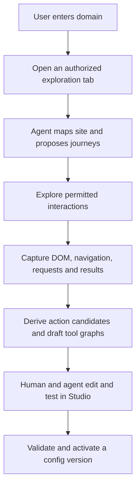

# Printing Press discovery: findings for the WebMCP project

Date: 2026-08-28

Status: recorded source and API research; not runtime validation of this repository.

**Current architecture decision:** the user selected “Use my browser” through the extension as the sole MVP discovery path and **ChatGPT as the external demo agent**. Studio does not host inference or an agent runner; managed-browser discovery is deferred. Browser/provider alternatives below are research history; the [project document](../project-brief.md) contains the current requirements.

Source revision inspected: [`56e2e46b8decb11fcca246b7c6f45ec04250fe08`](https://github.com/mvanhorn/cli-printing-press/commit/56e2e46b8decb11fcca246b7c6f45ec04250fe08), dated 2026-08-28. A shallow, sparse source copy was inspected without changing its tracked files. The installed Printing Press skill was an initial pointer; findings below use the pinned public source.

## Conclusion

A domain can be enough to start the proposed experience. Printing Press provides a concrete precedent for an agent researching a website, inferring useful journeys, driving browser interactions, and converting the observations into a structured specification.

It does not establish that every domain can be fully discovered, or that our extension can already register tools consumable by the intended WebMCP agent. Those remain separate claims requiring experiments.

Recommended product direction: **domain entry → visible browser exploration → discovered actions and draft tool graphs → human and agent refinement → validated activation**. A user intent can refine discovery without being mandatory at the initial input.

**Confirmed product entry and output:** Studio offers a creation flow where the user enters the domain for which they want WebMCP tools. The final discovery output conforms to our shared config standard, which Studio renders as an editable graph and the extension can import. Reddit is the user's proposed demo target, pending permitted access and runtime proof; a controlled public site remains a proposed fallback. Neither limits domain input. Discovery coverage and success on any particular site remain unproven.

## 1. Where Printing Press runs

The public website is an introduction and CLI catalog. The documented generation entry point is a skill invoked in a local coding agent, backed by a Go binary. It can produce both a CLI and an MCP server. The website is not evidence of a hosted domain-to-browser exploration service. [README](https://github.com/mvanhorn/cli-printing-press/blob/56e2e46b8decb11fcca246b7c6f45ec04250fe08/README.md#install)

## 2. How discovery works

| Stage                      | Observed behavior                                                                                                                                                                                                                     | Evidence                                                                                                                                                                                                                                                                                                                                       |
| -------------------------- | ------------------------------------------------------------------------------------------------------------------------------------------------------------------------------------------------------------------------------------- | ---------------------------------------------------------------------------------------------------------------------------------------------------------------------------------------------------------------------------------------------------------------------------------------------------------------------------------------------- |
| Resolve input              | Distinguish a supplied specification, HAR capture, and website URL. For a website, clarify whether the desired target is its official API or the website itself.                                                                      | [Input routing](https://github.com/mvanhorn/cli-printing-press/blob/56e2e46b8decb11fcca246b7c6f45ec04250fe08/skills/printing-press/SKILL.md#L866-L906)                                                                                                                                                                                         |
| Form a discovery objective | Research the product and likely workflows. The top workflow becomes the primary browser journey; secondary journeys are optional.                                                                                                     | [Research brief](https://github.com/mvanhorn/cli-printing-press/blob/56e2e46b8decb11fcca246b7c6f45ec04250fe08/skills/printing-press/SKILL.md#L1248-L1280), [journey selection](https://github.com/mvanhorn/cli-printing-press/blob/56e2e46b8decb11fcca246b7c6f45ec04250fe08/skills/printing-press/SKILL.md#L1588-L1608)                        |
| Drive the browser          | The agent uses browser tooling to inspect pages, click controls, fill forms, scroll, and visit subsequent states. The documented preferred path is the browser-use CLI, with other capture backends and manual HAR fallbacks.         | [Capture orchestration](https://github.com/mvanhorn/cli-printing-press/blob/56e2e46b8decb11fcca246b7c6f45ec04250fe08/skills/printing-press/references/browser-sniff-capture.md#L394-L457)                                                                                                                                                      |
| Record observations        | Collect resource URLs and request/response samples. The guide explicitly calls out POST-body capture, GraphQL operations, and the fact that page navigation can destroy page-installed interceptors.                                  | [Capture details](https://github.com/mvanhorn/cli-printing-press/blob/56e2e46b8decb11fcca246b7c6f45ec04250fe08/skills/printing-press/references/browser-sniff-capture.md#L537-L565), [capture data types](https://github.com/mvanhorn/cli-printing-press/blob/56e2e46b8decb11fcca246b7c6f45ec04250fe08/internal/browsersniff/types.go#L49-L80) |
| Analyze captured traffic   | The `browser-sniff` command requires a HAR or enriched capture file. It loads that file, analyzes it, and writes a specification, traffic analysis, and optional redacted samples. This command is not itself the browser explorer.   | [Command implementation](https://github.com/mvanhorn/cli-printing-press/blob/56e2e46b8decb11fcca246b7c6f45ec04250fe08/internal/cli/browser_sniff.go#L27-L129)                                                                                                                                                                                  |
| Infer a contract           | Code classifies useful traffic, groups endpoints, handles GraphQL operations, infers request/response fields from samples, and constructs a specification. These are inferences from observed samples, not complete vendor contracts. | [Specification generation](https://github.com/mvanhorn/cli-printing-press/blob/56e2e46b8decb11fcca246b7c6f45ec04250fe08/internal/browsersniff/specgen.go#L49-L169), [schema inference](https://github.com/mvanhorn/cli-printing-press/blob/56e2e46b8decb11fcca246b7c6f45ec04250fe08/internal/browsersniff/schema.go#L29-L105)                  |
| Enrich and generate        | An optional `crowd-sniff` path searches npm SDKs and GitHub code for additional endpoint evidence. Specifications then feed code generation and the agent's implementation/verification loop.                                         | [Community discovery](https://github.com/mvanhorn/cli-printing-press/blob/56e2e46b8decb11fcca246b7c6f45ec04250fe08/internal/cli/crowd_sniff.go#L33-L158), [generation entry](https://github.com/mvanhorn/cli-printing-press/blob/56e2e46b8decb11fcca246b7c6f45ec04250fe08/internal/cli/browser_sniff.go#L105-L111)                             |

The essential split is **agent judgment and browser orchestration** followed by **structured capture analysis and generation**. A domain starts the process; the agent still needs an exploration objective, which it can infer and then expose for user correction.

## 3. What this changes for our design

These are recommendations, not yet approved product decisions.

1. Let users begin with a domain. The agent first maps the visible site and proposes likely capabilities. An optional intent narrows the search.
2. Make the exploration plan visible in Studio. Users should see what the agent is trying and be able to stop or redirect it.
3. Keep discovery evidence alongside the editable configuration, rather than putting raw traffic into the distributable package. Record which interaction, request, and page change support each proposed step.
4. Produce both reusable action candidates and draft tool flows. Candidates should be instances of our supported node types, not dynamically downloaded executable code.
5. Preserve the boundary between observed, inferred, and tested behavior. An endpoint seen once is not yet a reliable tool.
6. Check the live page effect as well as returned data. A successful HTTP request alone does not establish that the user's UI reflects the tool's result.

### Recommended pipeline

## 4. Domain entry and browser control are technically distinct

**The extension is not inherently required for discovery.** The earlier extension-first recommendation assumed discovery in the user's local browser. Agent execution, browser access, and publishing WebMCP tools are separate choices.

| Discovery arrangement                                            | Our extension required?   | Main tradeoff                                                                                                                                                   |
| ---------------------------------------------------------------- | ------------------------- | --------------------------------------------------------------------------------------------------------------------------------------------------------------- |
| Studio backend runs an agent with a managed browser              | No                        | Can start from a website button; browser session is separate from the user's local session. We must supply agent integration, authentication, and compute.      |
| An authorized local runner uses an agent SDK and browser tooling | Not necessarily           | Requires installation or connection to a local process and an explicit browser-control integration. It does not automatically inherit access to every open tab. |
| Studio connects to our extension in the user's browser           | Yes, for this arrangement | Can target the user's local browser session after permission; extension still needs an agent runtime to decide what to do.                                      |

The managed-browser route has a concrete documented precedent: Browser Use's chat UI tutorial creates browser sessions from a Next.js server, returns a live preview URL, runs tasks, and streams agent events. API credentials stay server-side. This establishes a possible extension-free launch/control experience, not that our capture, config generation, or WebMCP integration is implemented. A remote session does not automatically share the user's local login. [Browser Use chat UI tutorial](https://docs.browser-use.com/cloud/tutorials/chat-ui)

For a local extension route, Chrome can create/navigate tabs and request host access. The `chrome.debugger` API provides a CDP transport to selected tabs, including Network, DOM, Input, Page, and Runtime, with the `debugger` permission. These are documented capabilities, not a tested project integration. [Chrome Tabs API](https://developer.chrome.com/docs/extensions/reference/api/tabs#permissions), [Chrome Debugger API](https://developer.chrome.com/docs/extensions/reference/api/debugger#permissions)

### Can Studio launch the user's chosen agent?

**For explicitly integrated agents, yes; for an arbitrary existing agent app/account/session through a universal browser API, no such mechanism is provided by WebMCP.** A provider selector, a new agent session, and connecting to an already-running user session are different features.

- The Codex SDK supports starting, continuing, and resuming local Codex threads from server-side applications. A local companion or our backend can host that integration; the browser page does not itself spawn the SDK runtime. [Codex SDK](https://learn.chatgpt.com/docs/codex-sdk)
- Codex App Server supports deeper application integration with authentication, approvals, sessions, and streamed events. Its WebSocket transport is documented as experimental, and requests carrying an `Origin` header are rejected. Do not design Studio to connect a hosted page directly to an unprotected local App Server. Any companion must be a deliberately authenticated integration that respects these protections. [Codex App Server](https://learn.chatgpt.com/docs/app-server)
- Claude Agent SDK runs the agent loop inside a Python or TypeScript application. Its documentation says third-party products must use the documented API-key authentication unless separately approved to offer claude.ai login/rate limits. Existing consumer subscriptions should not be assumed reusable. [Claude Agent SDK](https://code.claude.com/docs/en/agent-sdk/overview)
- ACP standardizes communication between compatible coding agents and clients, but its introduction still describes full remote-agent support as work in progress. It is a possible future integration direction, not a universal website-to-agent launcher. [ACP introduction](https://agentclientprotocol.com/get-started/introduction)

The current WebMCP draft supplies tool registration, discovery, and execution. It does not supply an agent process, inference, provider authentication, or a generic agent launcher. A user can instead start a compatible agent and ask it to operate Studio's exposed tools; that direction does not require Studio to launch the agent. Compatibility still needs testing with the intended consumer. [WebMCP API](https://webmachinelearning.github.io/webmcp/#api)

**Historical direction, superseded by later discussion:** an earlier proposal combined a Studio-operated discovery agent with a managed browser. The agreed MVP now uses a user-started external agent and extension-backed local discovery. Studio-operated inference and managed discovery are outside the MVP. Studio's shared graph and WebMCP editing surface remain central; actual registered-tool invocation must be demonstrated, not substituted with an ordinary backend call.

**Clarification checked on 2026-08-28:** we can build an agent loop using a model API: receive a tool request, execute authorized application code, return the result, and continue. This requires an implementation; it is not automatic access to a user's existing agent session. Alternatively, an external compatible agent can call the tools Studio exposes. Chrome documents agent chat in its WebMCP inspector extension as a development example, but our complete browser-discovery/editing flow still needs a real consumer test. [Official OpenAI tool-calling flow](https://developers.openai.com/api/docs/guides/function-calling#the-tool-calling-flow), [Chrome WebMCP inspector guidance](https://developer.chrome.com/docs/ai/webmcp#imitate_agent_chat_with_the_inspector_extension)

Keep credentials out of distributable config, minimize/redact discovery evidence, and require explicit authorization for browser access and consequential actions. Agent choice should not change the canonical graph format.

### ChatGPT demo compatibility

The user selected ChatGPT; Chrome's Tool Inspector is only a debugging aid. Official OpenAI documentation fetched on August 28 confirms native site tools in the desktop app's built-in browser. Its documented subset requires top-level imperative registration and does not discover declarative form tools or tools in iframes. It names Sol/Terra as supported, excludes Luna and Enterprise/Edu, and notes rollout/settings prerequisites. [Site tools](https://learn.chatgpt.com/docs/webmcp)

The built-in browser uses a separate profile from regular Chrome. OpenAI's separate browser extension can operate existing Chrome tabs and sessions, but its documentation does not establish native WebMCP consumption through that connection. The inspected pages also do not establish installation of our extension in the built-in browser. Do not infer that either path is impossible; verify the actual supported connection before committing to the full demo. [Built-in browser](https://learn.chatgpt.com/docs/browser), [Browser extension](https://learn.chatgpt.com/docs/chrome-extension)

First proof gate: ChatGPT reads/edits Studio through native WebMCP, reaches approved local discovery operations through our extension, and discovers/invokes an injected target-site tool. Direct Chrome extension messaging alone does not prove the connection across browser environments. No runtime experiment has been performed, and no additional relay or replacement agent has been approved. The [official challenge page](https://openai.com/webmcp-challenge/) confirms ChatGPT's in-app browser as a testing route, not the extension-specific integration.

## 5. Differentiation supported by the source

Printing Press's current capture guidance treats the browser as a temporary discovery aid. Its intended generated runtime must replay HTTP/HTML or another supported surface without retaining a browser; a surface requiring persistent page-context execution is a reason to stop or reconsider scope. [Runtime boundary](https://github.com/mvanhorn/cli-printing-press/blob/56e2e46b8decb11fcca246b7c6f45ec04250fe08/skills/printing-press/references/browser-sniff-capture.md#L8-L20)

Our proposed runtime would deliberately execute in the active page, while Studio exposes a shared graph model to the human and agent. The distinction is therefore the live application state and collaborative authoring experience. Printing Press already generating MCP servers means “it generates CLI, we generate MCP” would be inaccurate positioning.

## 6. Limits and proof gaps

| Claim                                                                                    | Current status                                                                                                  |
| ---------------------------------------------------------------------------------------- | --------------------------------------------------------------------------------------------------------------- |
| Printing Press documents a website-first discovery flow                                  | Confirmed in pinned source                                                                                      |
| Its browser-sniff binary analyzes already-captured traffic                               | Confirmed in implementation                                                                                     |
| A Chrome extension can open a target tab and instrument it with the required permissions | Supported by official API documentation                                                                         |
| A hosted application can start an agent-controlled browser without our extension         | Supported by the Browser Use tutorial; our integration is not tested                                            |
| Studio can integrate selected agent runtimes                                             | Supported by Codex/Claude documentation; authentication, browser tools, and integration still required          |
| WebMCP provides a universal way to launch the user's existing agent                      | Not provided by the inspected draft API                                                                         |
| Our agent can reliably explore a selected site and generate a useful graph               | Not tested                                                                                                      |
| Our fixed node palette is expressive enough for the chosen demo                          | Not tested; demo target still needs selection                                                                   |
| Extension-injected WebMCP tools are discovered and invoked by the intended consumer      | Not tested; remains a P0 gate                                                                                   |
| Judges can use the necessary extension/browser arrangement                               | Rules allow ChatGPT's in-app browser or WebMCP-enabled Chrome; installation of our extension is not established |
| Every arbitrary domain can be discovered safely and completely                           | No such guarantee                                                                                               |

Exploration must stop or ask for help at login, access restrictions, ambiguous actions, or consequential mutations. Discovering an action is not permission to execute it. Website content is evidence, not authority to expand scope. Domain-only discovery also needs limits on navigation, actions, time, and requests.

## 7. Next bounded experiment — proposed, not executed

Use a controlled site with a small search flow and no native WebMCP. Prove that a domain input can open the exploration tab, capture an interaction and its results, produce a supported tool graph, and import it into Studio. Then independently prove injected WebMCP registration, discovery, invocation, and visible page effects in the intended consumer environment.

Capture exact browser version, permissions, execution world, consumer, and failure conditions. Keep browser discovery feasibility separate from WebMCP injection feasibility so a success in one is not mistaken for proof of the other.

Current accepted product decisions, including optional authenticated discovery in the selected local tab, and the latest browser/judging research are maintained in the [project brief](../project-brief.md). Its delivery section cites the current official rules and Chrome documentation. Actual Studio WebMCP consumption, extension injection, and remote-to-local config execution remain untested.
